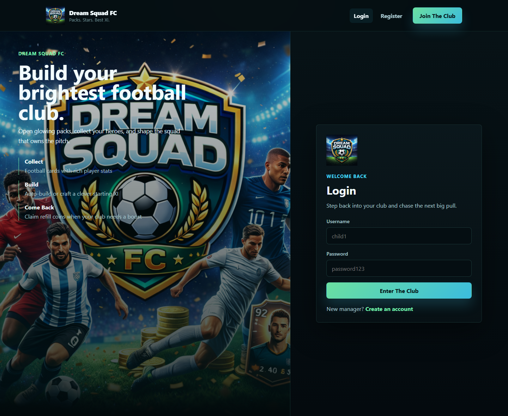
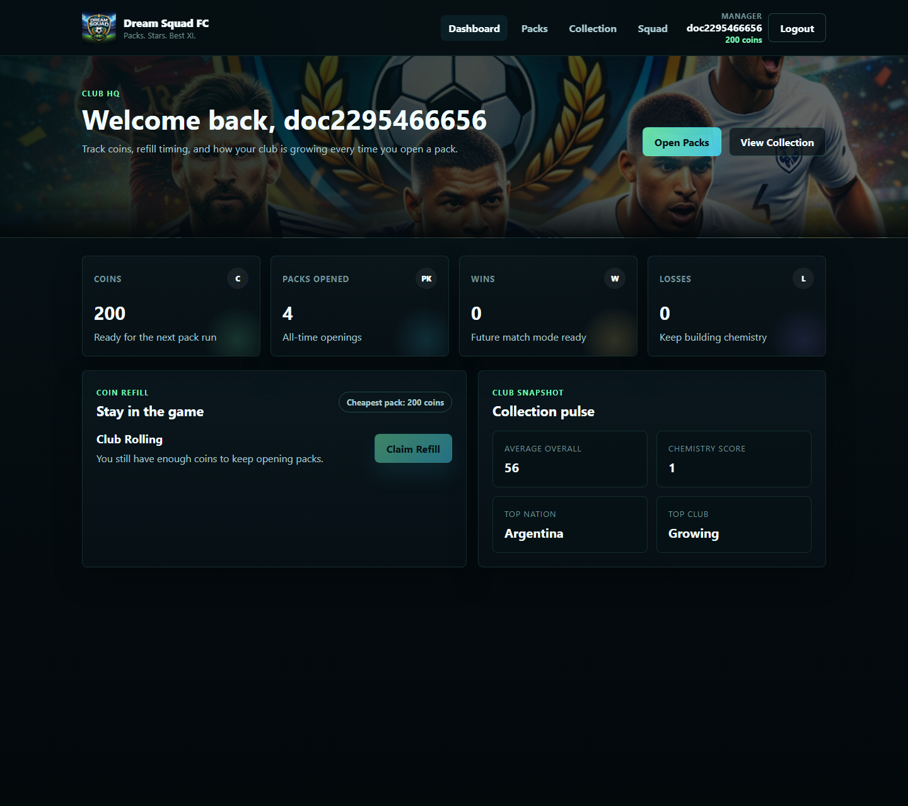
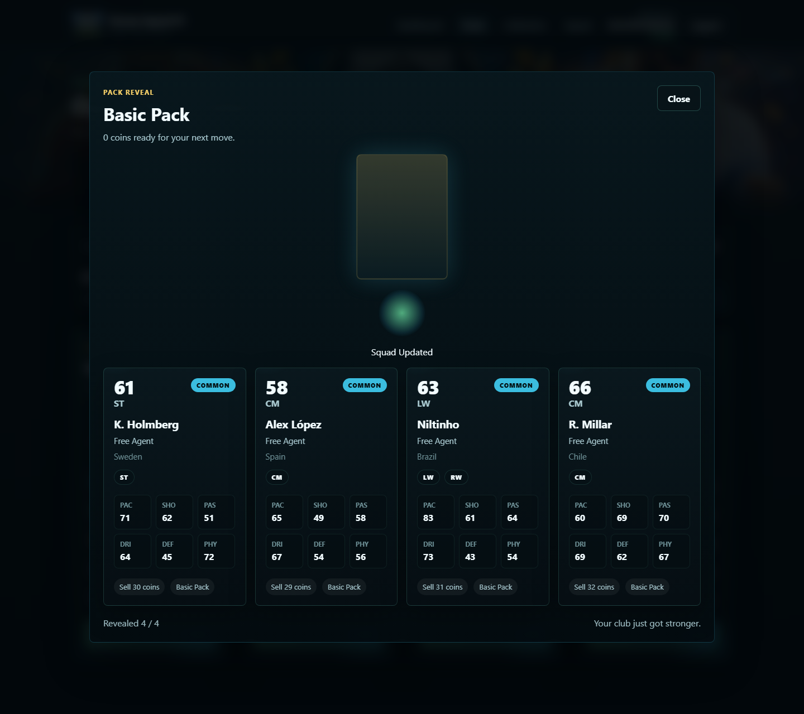
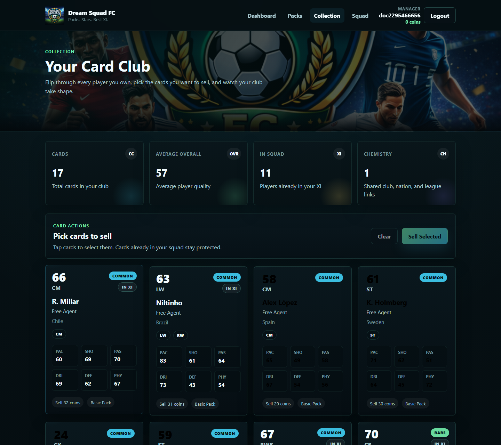
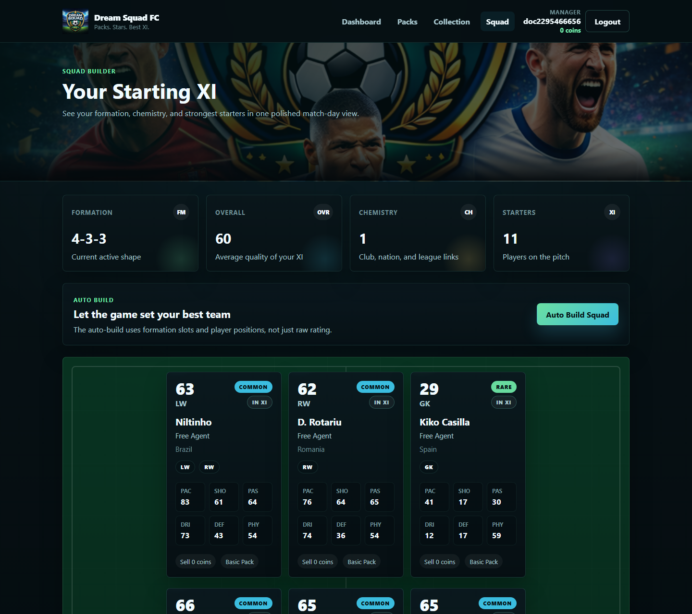

# Dream Squad FC Frontend

Dream Squad FC is a polished React frontend for a kids-friendly football pack opening and squad building game. This app sits on top of the Node.js/Express/MongoDB backend and turns the pack, collection, refill, and squad systems into a premium game-style experience.

## Screenshots

### Login


### Dashboard


### Pack Reveal


### Collection


### Squad


## Stack

- React with Create React App
- React Router DOM
- Axios
- Plain CSS
- Playwright for docs screenshot generation

## What The Frontend Does

- Handles register, login, session restore, and logout
- Stores the JWT in `localStorage`
- Protects game routes behind auth
- Reads the backend base URL from `.env`
- Shows the club dashboard with coins, refill state, packs opened, and record
- Lists available packs and opens them with an animated reveal modal
- Renders a rich player collection with selection and sell actions
- Builds and displays the current starting XI
- Tolerates multiple backend player shapes so the UI still works with rich imported football data

## Rich Player Data Support

The frontend does not assume a single rigid player schema. Player cards normalize and use as much of the backend data as possible:

- `name`, `long_name`, `fullName`, `full_name`, `short_name`
- `clubName`, `club_name`, `club`, `team`
- `nationality`, `nationality_name`, `country`
- `positions`, `player_positions`, `position`, `primaryPosition`
- `overall`, `overall_rating`, `rating`
- face stats such as `pace`, `shooting`, `passing`, `dribbling`, `defending`, `physic`

That means the UI works cleanly with imported FIFA-style documents from the `players` collection instead of only minimal mock data.

## Environment Configuration

The API connection is managed through the frontend `.env` file instead of being hardcoded inside the source.

### `.env`

```env
REACT_APP_API_BASE_URL=http://localhost:5000/api
```

### `.env.example`

An example file is included:

```env
REACT_APP_API_BASE_URL=http://localhost:5000/api
```

Important notes:

- In Create React App, frontend env vars must start with `REACT_APP_`
- Restart the frontend dev server after changing `.env`
- This improves configuration management, but frontend env vars are not true secrets because they are shipped to the browser
- Keep real secrets such as `JWT_SECRET` and database credentials on the backend only

## How It Works

### 1. Auth Boot Flow

On app load:

1. The app checks `localStorage` for `dream_squad_fc_token`
2. If a token exists, it calls `GET /api/auth/me`
3. If the token is valid, the user is restored into global auth state
4. If the token is invalid or expired, the app clears the session and redirects to login

### 2. API Layer

All requests go through `src/services/api.js`.

It does three things:

- Uses `REACT_APP_API_BASE_URL`
- Automatically injects `Authorization: Bearer <token>`
- Clears the stored session when a `401 Unauthorized` response is returned

### 3. Dashboard

The dashboard calls `GET /api/club` and shows:

- username
- coin balance
- packs opened
- wins
- losses
- refill availability
- cooldown timing
- collection summary insights when available

If the backend says the refill can be claimed, the page uses `POST /api/club/claim-refill`.

### 4. Pack Store

The packs page calls `GET /api/packs` and renders premium pack cards with:

- name
- cost
- min/max players
- rarity odds

When the player opens a pack:

1. The page calls `POST /api/packs/open/:packId`
2. Coins update from the backend response
3. Pulled cards are shown inside the reveal modal
4. The auth user is refreshed so the navbar coin count stays in sync

### 5. Collection

The collection page calls `GET /api/club/collection`.

It displays:

- overall
- position
- club
- nationality
- face stats
- pack source
- sell value
- whether a card is already inside the squad

The player can select one or many cards and sell them with `POST /api/club/sell`.

Cards marked as in the squad stay non-selectable in the UI so the player cannot accidentally try to sell protected starters.

### 6. Squad

The squad page calls `GET /api/squad` and renders:

- formation
- squad overall
- chemistry value when provided
- a pitch layout for the starting XI

The page also supports `POST /api/squad/auto-build`, then redraws the pitch with the new starters.

### 7. Defensive Backend Tolerance

The UI is intentionally defensive because backend game data can evolve.

Examples:

- pack results can arrive as `players`, `cards`, or `pulledCards`
- collection data can arrive as `collection` or `cards`
- squad data can arrive nested under `squad` or directly as the response body
- user ids can be `_id` or `id`

This keeps the frontend stable while the backend grows richer.

## Folder Map

```text
frontend/
  docs/
    snippets/
  public/
  scripts/
    capture-docs.js
  src/
    assets/
    components/
    context/
    pages/
    services/
    styles/
    utils/
    App.js
    index.js
  .env
  .env.example
  package.json
  README.md
```

## Key Frontend Files

- `src/context/AuthContext.jsx`  
  Global auth state, token restore, login, register, logout

- `src/services/api.js`  
  Shared Axios client and auth header injection

- `src/components/ui/PlayerCard.jsx`  
  Rich player normalization and collectible card rendering

- `src/components/pack/PackRevealModal.jsx`  
  Animated pack opening reveal flow

- `src/pages/Dashboard.jsx`  
  Club stats, refill state, and summary insights

- `src/pages/Packs.jsx`  
  Pack listing and open-pack flow

- `src/pages/Collection.jsx`  
  Collection browsing and sell flow

- `src/pages/Squad.jsx`  
  Formation, overall, chemistry, and auto-build flow

## Local Setup

### 1. Install dependencies

```bash
npm install
```

### 2. Create the frontend env file

PowerShell:

```powershell
Copy-Item .env.example .env
```

### 3. Make sure the backend is running

The backend should be available at the same URL used in `.env`, for example:

```text
http://localhost:5000/api
```

### 4. Start the frontend

```bash
npm start
```

Create React App usually opens on:

```text
http://localhost:3000
```

If that port is already in use, CRA may move to another port such as `3001`.

## Available Scripts

### `npm start`

Runs the app in development mode.

### `npm run build`

Builds the production bundle into `build/`.

### `npm run docs:screenshots`

Generates the README screenshots into `docs/snippets/`.

Requirements:

- backend running
- frontend running
- Playwright browsers installed

Example in PowerShell when the frontend is running on port `3001`:

```powershell
$env:DOCS_FRONTEND_URL="http://127.0.0.1:3001"
npm run docs:screenshots
```

If needed, you can also override the API used by the capture script:

```powershell
$env:DOCS_API_URL="http://127.0.0.1:5000/api"
```

## Frontend Routes

- `/login`
- `/register`
- `/dashboard`
- `/packs`
- `/collection`
- `/squad`

Route `/` redirects to:

- `/dashboard` when logged in
- `/login` when logged out

## Backend Endpoints Used

- `POST /api/auth/register`
- `POST /api/auth/login`
- `GET /api/auth/me`
- `GET /api/club`
- `POST /api/club/claim-refill`
- `GET /api/club/collection`
- `POST /api/club/sell`
- `GET /api/packs`
- `POST /api/packs/open/:packId`
- `GET /api/squad`
- `POST /api/squad/auto-build`

## Troubleshooting

### The frontend cannot reach the API

- check `REACT_APP_API_BASE_URL` in `.env`
- confirm the backend is running
- restart the frontend after changing `.env`

### The app logs out unexpectedly

The Axios layer clears the session on `401` responses. This usually means the JWT is missing, invalid, or expired.

### Pack or player fields look inconsistent

The frontend already normalizes several backend shapes. If new football data fields are introduced, extend the normalization in `src/components/ui/PlayerCard.jsx`.

## Current Status

This frontend is production-structured, modular, responsive, and ready to keep expanding as Dream Squad FC adds deeper pack logic, richer player metadata, and more game systems.
